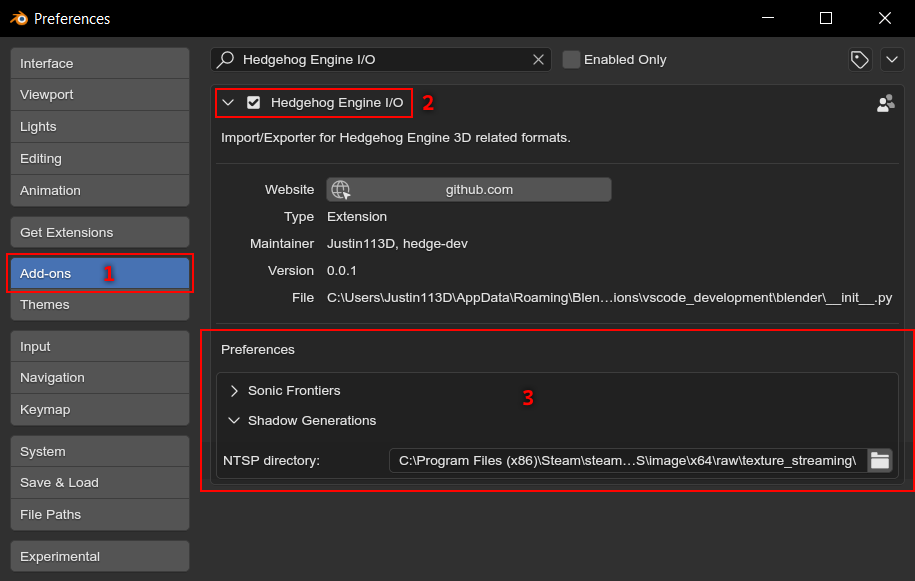

:og:description: Configure the addon to make use of its full power
:og:image: _images/index_addon_config.png

.. _guides-addon-configuration:

#####################
Configuring the addon
#####################

Before doing anything, you may want to take a look at the :ref:`addon preferences <bpy.types.HEIO_AddonPreferences>`.

You can find the addon preferences under :menuselection:`Edit --> Preferences --> Add-ons --> Hedgehog Engine I/O`

	The addons preferences

Target specific settings
========================

Each registered game may have any of these properties

NTSP directory
	NTSP files, short for ``Needle texture streaming package``, were introduced with Sonic
	Frontiers and pack textures into a single file to allow for reusing of texture data
	in seperate packs, as well as and realtime data streaming.

	Games that make use of texture streaming always put their NTSP files in
	``/image/x64/raw/texture_streaming`` from the target games root folder.

	If the addon attempts to read a streamed texture without an NTSP directory specified,
	it will create a placeholder image instead.