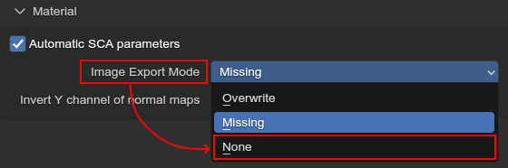
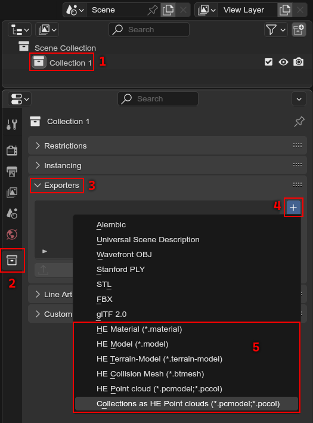
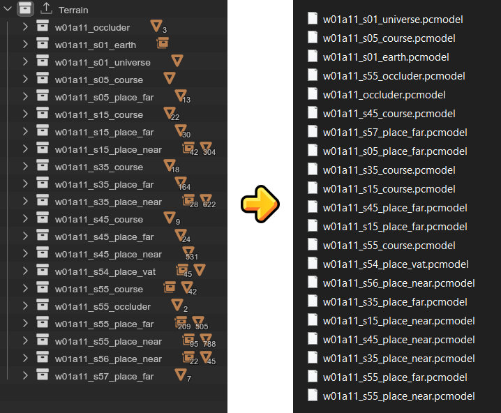

:og:description: Exporting assets to files
:og:image: _images/index_asset_exporting.png

###############
Asset exporting
###############

.. attention::
	Please make sure you have read these guides before continuing here

	:Addon Configuration: 	:ref:`[Open] <guides-addon-configuration>`
	:Project Setup: 		:ref:`[Open] <guides-project-setup>`

.. tip::

	All exporters print a progress bar to the console, which can help estimate how long the export
	is going to take until completion!

Materials
=========

Once you are done editing your material(s), they can be exported as .material files. Usually, this
is done automatically by e.g. the model exporter, but you can also export materials independently.

.. important::

	Materials are exported to files with their names!

	E.g. a material with the name ``MySonicFur`` gets
	exported as ``MySonicFur.material``, so make sure that your materials are correctly named before
	exporting!

.. dropdown:: Batch export materials
	:icon: upload

	The standard way of exporting materials is to export all materials of specific objects. Which
	objects get picked depends on the :ref:`"limit to" export properties <tools-export-common-properties>`.

	To export materials of objects, open :ref:`the exporter <bpy.ops.heio.export_material>`,
	select a directory to export to, configure the export properties and confirm.

	.. figure:: images/asset_exporting_material_1.png

		Where to find the exporter

.. dropdown:: Export a single material
	:icon: upload

	You can export a single material by selecting it, opening
	:ref:`the exporter in the material specials <bpy.ops.heio.export_material>`,
	select a directory to export to, configure the export properties and confirm.

	.. figure:: images/asset_exporting_material_2.png

		Where to find the exporter

Texture images during export
----------------------------

Textures are exported using the
`Blender DDS Addon <https://github.com/matyalatte/Blender-DDS-Addon>`_ addon, so you need to have
that installed if you want to do so.

It should be noted that HE2 games often use BC6 or BC7 encoding, which can take very long to export
for large textures. If you did not edit any textures, it'd be best if you don't export them at all
by disabling image export and instead use the original files.

	How to disable image exporting

Models
======

Models are exported by the :doc:`object trees </guides/object_trees>` in your project. One object
gets exported as one file, unless you choose ``Merge`` for the mesh mode, in which case all object
trees are exported to one selected file.

By convention, a ``.model`` files object tree should have an armature as its root, but you can also
export non-armature object trees.

.. dropdown:: How to export .model files
	:icon: upload

	Open :ref:`the exporter <bpy.ops.heio.export_model>`, select a directory/file to export to,
	configure the export properties and then confirm.

	.. figure:: images/asset_exporting_model.png

		Where to find the exporter

Terrain models
--------------

Terrain models basically work just the same as regular models, just without morph models or
bone and weight information.

By convention, a ``.terrain-model`` files object tree should have a mesh as its root, but you can
also export armature object trees, although the bone and weight information will be lost.

.. dropdown:: How to export .terrain-model files
	:icon: upload

	Open :ref:`the exporter <bpy.ops.heio.export_terrain_model>`, select a directory/file to export to,
	configure the export properties and then confirm.

	.. figure:: images/asset_exporting_terrain_model.png

		Where to find the exporter

Collision meshes
================

Collision meshes too are exported by the :doc:`object trees </guides/object_trees>` in your
project. One object gets exported as one file, unless you choose ``Merge`` for the mesh mode,
in which case all object trees are exported to one selected file.

By convention, a ``.btmesh`` files object tree should have a mesh as its root, but you can also
export armature object trees, although the bone and weight information will be lost.

.. dropdown:: How to export .terrain-model files
	:icon: upload

	Open :ref:`the exporter <bpy.ops.heio.export_collision_mesh>`, select a directory/file to export to,
	configure the export properties and then confirm.

	.. figure:: images/asset_exporting_bullet_mesh.png

		Where to find the exporter

Point Clouds
============

Point clouds export each object tree in your project as an instance, and (unless disabled) also the
corresponding resource file (``.terrain-model``, etc).

.. dropdown:: How to export .pcmodel or .pccol files
	:icon: upload

	Open :ref:`the exporter <bpy.ops.heio.export_point_cloud>`, select the type of point cloud to
	export, select the file to export to, configure the export properties and then confirm.

	.. figure:: images/asset_exporting_point_cloud.png

		Where to find the exporter

Collection exporters
====================

Every exporter is available as a collection exporter, which allows you to perform the same export
at a single button press without having to re-set it up and select the export destination.

These exporters will export only the contents of the collection they are added to, meaning you can
easily isolate other objects from your export too.

This way, you can set up multiple different exporters too, e.g. have one point cloud exporter for
collisions, and one for terrain.

	The collection exporters added by HEIO

.. warning::

	Blenders collection exporters **do not** like directory exporters, and will tell you that you
	have an invalid export filepath if no actual file specified, despite most exporters not needing
	one.

	In that case you must specify a "dummy" output file to make the exporter work.

	.. figure:: images/asset_exporting_collection_exporters_dummy.png

		A collection exporter with a dummy file path

Collections as HE Point Clouds
------------------------------

This is an exporter unique to collection exporters. It exports all immediate child collectionns of
the collection with the exporter to individual point cloud files.

	An example for a stage project with multiple collection that get exported as individual point cloud files