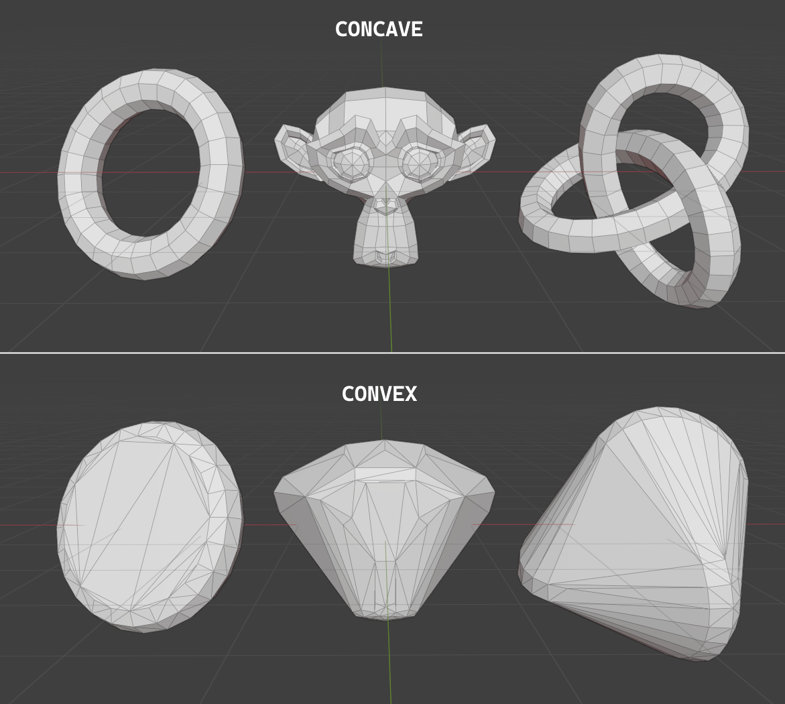
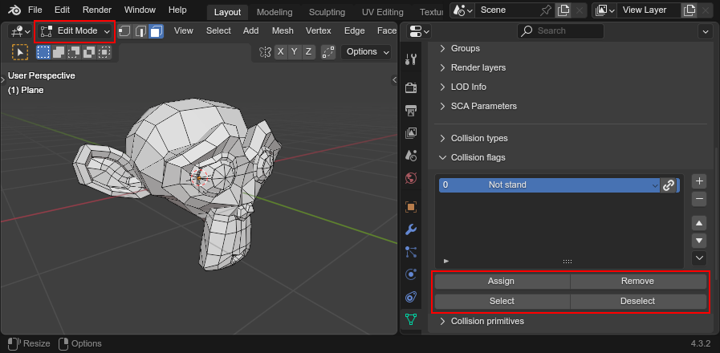
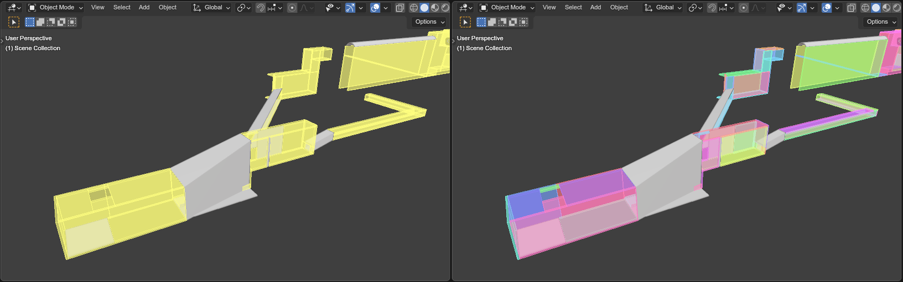
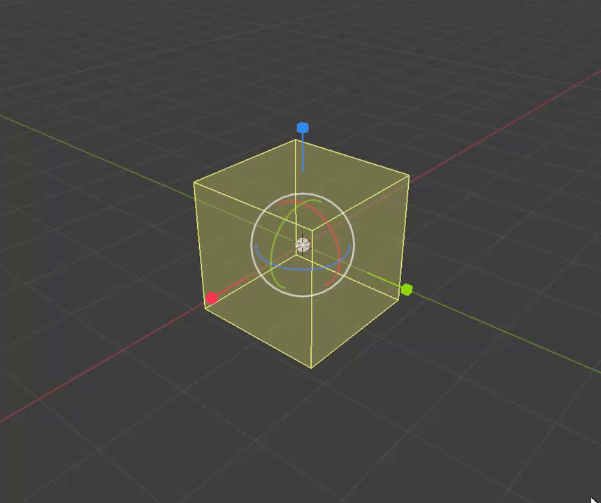

######################
Collision mesh editing
######################

HEIO provides a lot of new tools to edit collision meshes (``.btmesh`` files) that have not existed
before, like editing per-polygon types and flags, as well as dividing a collision mesh into shapes
and adding collision primitives.

This guide should go over everything needed to edit those.

Shapes
======

Collision meshes are divided into "shapes", each of which is a single collision unit within the
mesh for better performance. HEIO divides collision meshes into shapes using
:doc:`mesh groups </user_interface/object/mesh/groups>`.

Sonic team sometimes favors big collision meshes with many shapes over reusing individual collision
files, probably to avoid time spent reading files. An example is the start of Kingdom Valley Act 1
in Shadow Generations:

When Importing the file ``w03a10_misc/w03a10_s15_col.btmesh``, you are met with one big mesh for
the majority of the entire stage. By splitting it with the
:ref:`"Split mesh by groups" <bpy.ops.heio.split_meshgroups>` operator and changing the viewport
object color to "random", we can make out the individual shapes:

.. figure:: images/collision_mesh_editing_shape_colors.png

	The individual shapes in the collision mesh made visible

Convex Shapes
-------------

By default, shapes are "concave", meaning they contain actual polygons to describe surface that
things can collide with in the game.

However, there is a second, more performant type of shape called a "convex" shape, which is only
described by vertices, and has no actual polygon information. To collide with a convex shape,
the game simply checks if something is "inside" the space between the shapes' vertices.

You can turn a mesh group convex in the groups properties:

	How to make a mesh group convex

While internally, these shapes don't have polygonal information, they would be difficult to work
with in blender, as you cannot see disconnected vertices outside of blenders edit mode. On top of
that HEIO divides a mesh into shapes by assigning polygons to a group, not vertices. That is why
HEIO imports convex shapes with generated polygons, instead of just the vertices.

Exporting a convex shape with concave areas will result in those concave areas disappearing:

	Meshes with concave features, and their exported convex counterparts

Layers
======

Each shape gets assigned a collision layer that determines the basic logic when something interacts
with the shape, e.g. ``Solid`` makes the collision impassable, while ``Water`` lets you fall through
it (and more).

While mostly the same, some layers differ between the games, e.g. the layer with the value ``9`` is
called ``Solid Mesh`` in Shadow generations and ``Leaf`` in Sonic Frontiers.

You can change the layer in the mesh group settings:

.. figure:: images/collision_mesh_editing_layer.png

	Where to change the layer of a mesh group

To make editing the layer easier, each target game comes with a list of layers attached to values
to make editing easier.

However, there is also the option to set a custom value for a layer by toggling the chain icon to
the left of the layer dropdown. While this is rarely, if not needed at all, it is an available
option.

Types
=====

Most types alter the visual and audial feedback when interacting with the shape, like the particles
that pop up when e.g. walking across, as well as the footstep sounds.

There are some exceptions to that rule, like ``no entry`` in Sonic Frontiers, which halts your
movement and plays the "You stray from the path" mini event.

While mostly the same, some types differ between the games, e.g. the type with the value ``29`` is
called ``Wet 3`` in Shadow generations and ``Sand 2`` in Sonic Frontiers.

Types act likes materials, where each mesh has a list of types and where every polygon in the mesh
gets assigned to an item in that list.

Types setup
-----------

When first opening the collision types subpanel you are met with a button that says "Initialize
mesh info" (unless it's an imported mesh that already had types):

.. figure:: images/collision_mesh_editing_initialize_types.png

	The collision types panel on a mesh

Pressing it will do 2 things:

- A single type slot will be created in the list (as the list needs at least one entry to make sense)
- A new mesh attribute gets added by the name of ``HEIOCollisionType``

The attribute group is responsible for assigning each polygon which type slot is used, so don't
delete it!

.. figure:: images/collision_mesh_editing_types_connection.png

	The collision types list and the mesh attribute that it relies on

Editing the types list
----------------------

You can add, remove and move slots. A polygon connects to the same slot, even after it is moved.
By clicking the type name, you can choose from a list of types defined by the target game.

Similar to the layer, you can choose a custom value here too by toggling the chainlink icon next
to the type dropdown. **Values above 255 do not get exported.**

If you want to remove all types entirely, you can do so by opening the context menu in the bottom
right of the panel and clicking the ``delete mesh info`` button. This will remove all items from
the list, as well as delete the ``HEIOCollisionType`` attribute.

Editing polygons types
----------------------

Just like materials, you can edit as polygons collision type by entering edit mode. This will make
tree operators visible below the list, which act 1:1 how they do for materials, but for the
collision types instead:

- ``Assign`` will assign all selected polygons to the selected collision type slot
- ``Select`` will select all polygons assigned to the selected collision type slot
- ``Deselect`` will deselect all polygons assigned to the selected collision type slot

.. figure:: images/collision_mesh_editing_type_editing.png

	The three type editing operators visible below the types list

Types on convex shapes
----------------------

Since convex shapes have no polygons, they can only have one type across the entire shape.

You can change a convex shapes type below the convex toggle, which works just like changing types
in the types list:

.. figure:: images/collision_mesh_editing_type_convex_shape.png

	Where to edit the collision type of a convex shape

Flags
=====

Flags are best seen as an extension to the shapes layer; They add additional behavioral properties
for when interacted with, e.g. ``Knuckles Parkour`` makes a wall climbable for knuckles in Sonic
Frontiers, and ``Amoeba`` makes Shadow stay in squid form in Shadow Generations.

While mostly the same, some flags differ between the games, e.g. the flag with the value ``2`` is
called ``Slider`` in Shadow generations and ``Rest`` in Sonic Frontiers.

Types act similar to materials, where each polygon can have an arbitrary number of flags assigned.

Flags setup
-----------

When first opening the collision flags panel you are met with a button that says "Initialize mesh
info" (unless it's an imported mesh that already had flags):

	The collision flags panel on a mesh

Pressing it will do 2 things:

- A single flags slot will be created in the list (as the list needs at least one entry to make sense)
- A new mesh attribute gets added by the name of ``HEIOCollisionFlags``

The attribute group is responsible for assigning each polygon which type slot is used, so don't
delete it!

.. figure:: images/collision_mesh_editing_flags_connection.png

	The collision flags list and the mesh attribute that it relies on

Editing the flags list
----------------------

You can add, remove and move slots. A polygon connects to the same slots, even after any of them
is moved. By clicking the slot name, you can choose from a list of types defined by the target game.

Similar to the layer and type, you can choose a custom value here too by toggling the chainlink
icon next to the flags dropdown. **Values above 31 do not get exported.**

If you want to remove all flags entirely, you can do so by opening the context menu in the bottom
right of the panel and clicking the ``delete mesh info`` button. This will remove all items from
the list, as well as delete the ``HEIOCollisionFlags`` attribute.

Editing polygons flags
----------------------

Different from materials, a polygon can have more than one flag, as well as none at all. You can
edit the flags assigned to a polygon by entering edit mode, which will make four operators
visible below the list:

- ``Assign`` will add all selected polygons to the selected collision type slot
- ``Remove`` will remove all selected polygons from the selected collision type slot
- ``Select`` will select all polygons added to the selected collision type slot
- ``Deselect`` will deselect all polygons added to the selected collision type slot

	The four flags editing operators visible below the flags list

Flags on convex shapes
----------------------

Since convex shapes have no polygons, they can only have one set of flags across the entire shape.

You can add and remove flags in the list below the convex collision type:

.. figure:: images/collision_mesh_editing_flags_convex_shape.png

	Where to edit the collision flags of a convex shape

Collision Primitives
====================

Sometimes using shapes made of vertices and polygons can be a little overkill, either not being
worth the time it takes to make them, or simply not being performane enough.

For cases like these, collision meshes have "primitives", which are simple, parameterized shapes
that are placed in a collision mesh like objects.

There are 4 types of primitives: Spheres, Boxes, Capsules and Cylinders:

	The 4 types of primitive shapes, from left to right: Sphere, Boxe, Capsule and Cylinder.

Adding primitives
-----------------

You can add and remove primitives in the collision primitive panel, which is found below the
collision flags panel:

.. figure:: images/collision_mesh_editing_primitive_list.png

	The collision primitives list panel

Rendering primitives
--------------------

HEIO implements a custom viewport renderer to make those primitives visible and easier to edit.
There are several settings that let you customize how primitives appear, available in the
viewport overlay settings:

	The HEIO collision primitive overlay settings

Random colors
^^^^^^^^^^^^^

Usually, each primitive type has the same color:

- Spheres are red
- Boxes are yellow
- Capsules are green
- Cylinders are cyan

This may make viewing individual primitives difficult, especially when there are a lot of them.
That is what the ``Random Colors`` toggle is for; When enabled, every primitive will be rendered
with a different color:

	A portion of the stage collision from the DLC stage from Shadow Generations. Left with regular, and right with randomized colors.

Editing primitives
------------------

A collision mesh has 5 core properties:

- a shape type
- transforms
- a layer
- a type
- Flags

The shape type can be changed right below the list.

The layer works just like for mesh groups, and the type and layers work just like for convex mesh
groups.

However, editing the transforms from these few fields is incredibly cumbersome, especially the
rotation, which is why HEIO adds new workspace tools to blender:

.. figure:: images/collision_mesh_editing_primitive_tool.png

	The new collision primitives workspace tool

When pressing down on the tool for a second, you can select between 2 tools:

	The different tools avaiable

You will find 2 new workspace tools in total:

Select collision primitive
^^^^^^^^^^^^^^^^^^^^^^^^^^

This allows you to select a primitive shape in viewport by clicking it with your cursor.

.. note::
	This unfortunately only works for the shapes on the active object right now. A better solution
	will be looked into in the future.

When this tool is active, the tool properties show the primitives list of the active object

.. figure:: images/collision_mesh_editing_primitive_tool_properties.png

	The workspace properties

Transform collision primitives
^^^^^^^^^^^^^^^^^^^^^^^^^^^^^^

This tool is an extension to the select tool; It can select primitives, and when one is selected
it displays transform gizmos to move, rotate and scale the selected primitive.

.. figure:: images/collision_mesh_editing_primitive_tool_gizmos.png
	:figwidth: 50%

	The different available transform gizmos for primitives

These work mostly the same as the standard transform gizmos for objects:

- Drag the circle at the center to move the object
- Drag the circles to rotate around the given axis
- Drag the scale pins to scale
- Hold SHIFT for precision mode
- Hold CTRL for snap mode
- Hold ALT while scaling to scale in one direction

	Scaling a primitive in one direction

.. note::
	Not all shape types show all rotate gizmos. E.g. the sphere shows no rotate gizmos at all,
	since there is no point in rotating a sphere.

Splitting
---------

Maybe the HEIO tools for editing the primitives transforms are not comfortable enough for you,
which is understandable; Fortunately, there is an alternative!

You can use the :ref:`"Split mesh by groups" <bpy.ops.heio.split_meshgroups>` operator (mentioned
near the start of this guide) to split existing primitives into individual objects, and then
transform the objects regularly instead of with the tool gizmos.

However, the scale of the object is ignored, and you will still have to change the primitive
dimensions either with the gizmos or by directly changing the properties in the primitives panel.

Converting to geometry
----------------------

In the event that you want to convert collision primitives to polygonal geometry, you can use the
:ref:`Collision primitives to geometry operator <bpy.ops.heio.collision_primitives_to_geometry>`,
which does just that.

.. figure:: images/collision_mesh_editing_primitives_converted.png

	The primitives from before converted to geometry at the default resolution

You can change the resolution of the generated geometry in the operator window in the bottom left
of the viewport.

Each primitive receives its own convex mesh group, which retains the layer, type and flags (the
type and flags also get added to the polygonal types and flags, in case you don't want them to be
convex).

This can be useful for when porting the stage to another game that does not use the .btmesh format.