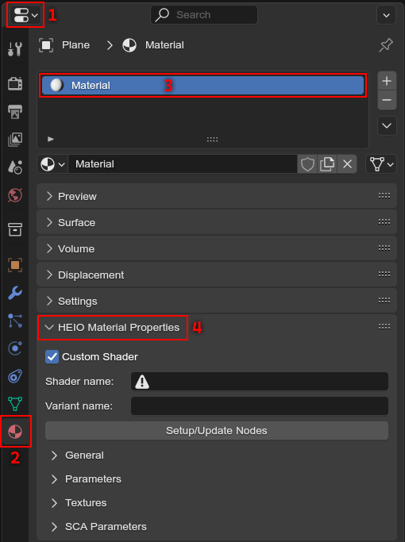
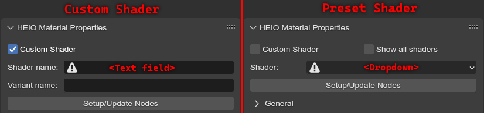
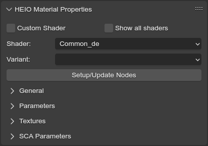
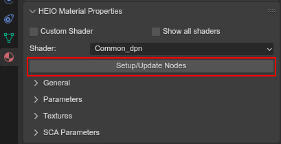
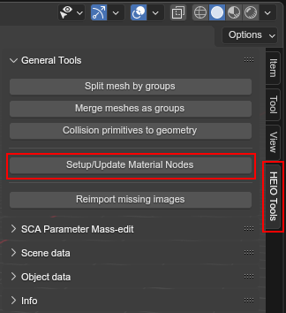

################
Material Editing
################

.. attention::
	Please make sure you have read these guides before continuing here

	:Project Setup: 		:ref:`[Open] <guides-project-setup>`

Hedgehog engine games store model rendering information in ``.material`` files, which are very
similar to how blender handles materials. As such, HEIO adds a new panel to the material editor
that makes it possible to edit every single aspect of a hedgehog engine material!

The HEIO material panel
=======================

A new panel is visible in the material properties (regardless of the render engine used):

	Where to find the HEIO Materia Panel

Editing materials
=================

Setting up the shader
---------------------

The heart of every material is its shader: A shader is essentially a small program telling the GPU
how a model gets rendered. Materials tell the game which shader to use as well as passing over
options like parameters and textures to be used by the shader.

Every game has its own list of shaders. A full list of the usable shaders for each game can be
found :doc:`here </material_templates/index>`.

If you created a new material, it will be set up to use a
:ref:`custom shader <bpy.types.HEIO_Material.custom_shader>` and have no shader set. Custom Shaders are only
useful if the shader you want to use is somehow not set up for the target game, or when you want
to use a custom shader.

In 99.9% of cases, you dont need to use the custom shader feature, and can disable it.
Upon doing so, the shader name textfield will be swapped out for a dropdown.

	Difference between a custom shader and a preset shader

By default, the list of shaders is (usually) a small selection of commonly used shaders from
the larger shader list. If the shader you want to use is not part of the selection, enable
:ref:`"Show all shaders" <bpy.types.HEIO_Scene.show_all_shaders>`.

If no shader is selected, the addon will show a warning sign in the property.
Always make sure to select a shader!

Shader variants
^^^^^^^^^^^^^^^

Hedgehog Engine 1 games made use of "shader variants", which are shaders with specific
technical features, like enabling bone deformations or vertex colors. Each character in a
variant name denotes one feature, e.g. ``b`` may enable ``bone deformation``.

If a shader has variants, you can select those via a second dropdown.

	Available shader variants for the shader ``Common_de`` for Sonic Unleashed

Each target games shader features and their purposes are documented `here <https://hedgedocs.com/index.php/Shader_Features>`_.

.. _guides_material_editing_node_setup:

General properties
------------------

These are direct material settings that are strictly part of every material.

*Clip Threshold* and `Backface Culling <https://docs.blender.org/manual/en/latest/render/eevee/material_settings.html#bpy-types-material-use-backface-culling>`_
are default blender material properties added here for convenience and have the same effect ingame
as they do here.

:ref:`Use additive blending <bpy.types.HEIO_Material.use_additive_blending>` does exactly as it says: Instead
of alpha blending, it makes the shader use `additive blending <https://www.learnopengles.com/tag/additive-blending/>`_.

For info on render layers read the :doc:`render layers <render_layers>` guide.

Parameters
----------

These are values that get passed to the shader, like a diffuse color or similar.

Every shader can define their own custom parameters, of which the usage is fully up to
the shader itself and may need fiddling and/or reverse engineering to figure out how they work.

For more detailed information about parameters, read
:doc:`HEIO Material Parameters </user_interface/object/material_parameters>`

.. note::

	All shaders, **even those that dont actually use them**, have the following parameters:

	- diffuse
	- specular
	- ambient
	- emissive
	- power_gloss_level
	- opacity_reflection_refraction_spectype

	These are legacy hedgehog engine 1 parameters, and are part of ever shader to ensure compatibility
	with every engine and tool.

.. caution::

	**Changing the shader preset** will add new parameters with their default values
	and **remove old unused parameters**. Be aware of this when trying out a different shader
	or similar!

Textures
--------

Textures are very simple: You have slots with certain types, and these get used by the shader for
various purposes.

For more detailed information about textures, read

- :doc:`HEIO Material Textures </user_interface/object/material_textures>`
- `HE1 Texture documentation <https://hedgedocs.com/index.php/Hedgehog_Engine_-_Textures>`_
- `HE2 Texture documentation <https://hedgedocs.com/index.php/Hedgehog_Engine_2_-_Textures>`_

.. important::

	Textures are exported using the `Blender DDS Addon <https://github.com/matyalatte/Blender-DDS-Addon>`_,
	which allows you to set the DDS encoding to use when exporting for each image.

	.. figure:: images/material_editing_dds_encoding.png

		Where to find the DDS encoding settings

SCA Parameters
--------------

SCA parameters are additional information that can be attached to a file in Sonic Lost World and games
released after.

For more detailed information about SCA parameters, read

- :doc:`HEIO SCA Parameters </user_interface/object/sca_parameters>`
- `Material SCA parameters <https://hedgedocs.com/index.php/SCA_Parameters#Material_Parameters>`_

Blender material preview
========================

Blenders material system differs wildly from how games handle them, using nodes for every material
instead of shaders. However, this shall not get in the way of previewing materials in blender!

Registered shaders in the addon (may) have a material node template, which is then copy-pasted into
the material and automatically updated with the parameters and textures.

.. note::

	Material templates have to be created manually, which is why many may be missing from the addon
	as a whole. In those cases, a fallback template will be used that won't accurately reflect
	how the material looks ingame.

Applying templates
------------------

Templates are automatically applied on import, but not for manually set up materials. To apply the
material template, you must press the :ref:`Setup/Update nodes <bpy.ops.heio.material_setup_nodes_active>`
button:

	Where to find the setup/update nodes button

.. important::

	**You will also have to do this whenever you change the shader of a material!**

You can also update nodes of multiple materials at once using the
:ref:`Setup/Update Material Nodes <bpy.ops.heio.material_setup_nodes>` button:

	Where to find the setup/update material nodes button

Updating materials
------------------

Once a material template is applied, you are done! Now, whenever you edit parameters or textures
the addon will automatically update the node tree too!
