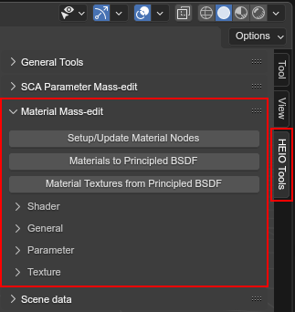
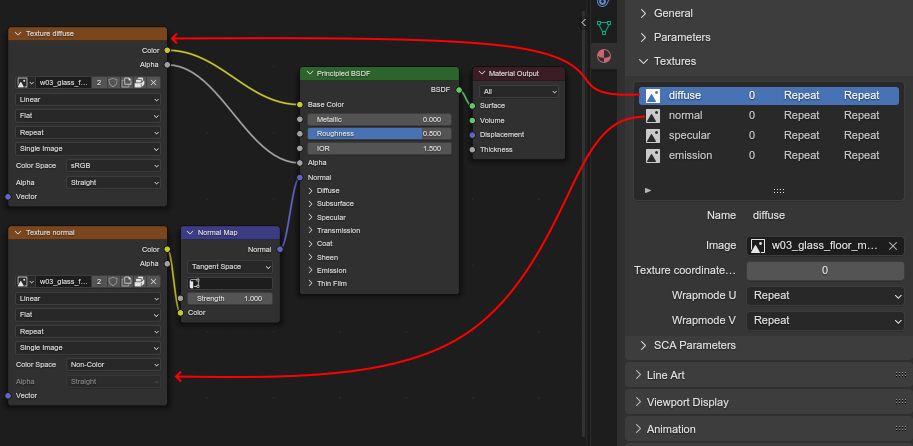

#####################
Material Mass-editing
#####################

Occasionally you may run into a situation where you need to edit many materials as once, which is
not possible with standard blender tools. For this reason HEIO includes special "Mass-Edit" tools
made specifically for materials!

	Where to find the mass-edit tools

General Tools
=============

There are three general purpose tools:

Setup/Update material nodes
---------------------------

A multi-material version of the ``Setup/Update Nodes`` operator found in the HEIO Material
properties panel.

Materials to Principled BSDF
----------------------------

Use this if you want to export a model imported with HEIO and include textures. It will assemble a
standard Principled BSDF node tree and include the materials ``diffuse`` and ``normal`` texture, if
it has them.

	A material turned into a principled bsdf node tree for exporting

.. note::

	Only diffuse and normal maps are included as those are the only 2 textures that are used
	(mostly) consistently across all shaders of all games.

	Including more textures would make this process needlessly complicated, at which point it'd be
	better to set up the materials wherever you want to use them manually with your own methods.

Material textures from Principled BSDF
--------------------------------------

Essentially the inverse of the previous tool, this one will search the material node tree for
``diffuse`` and ``normal`` textures and insert them in the HEIO material textures **if they
already have slots!!**

For example: if you imported a ``.fbx`` model that has diffuse and normal textures and wanted to
port that to Shadow Generations, then you'd do this in 2 steps:

1. Select all imported models and update the shader to use the ``Common_dn`` preset (elaborated further down in this guide). This will also create the ``diffuse`` and ``normal`` texture slots on the materials.
2. Press the ``Material textures from Principled BSDF`` button

And done! Now all materials of the imported should have the ``Common_dn`` shader with diffuse and
normal textures!

Mass-Editing material properties
================================

These tools let you edit HEIO material properties across all selected objects at the same time.

There are 4 distinct editors:

Shader
------

Works exactly like you think it would; Set up a shader and it's copied over to all materials of
all selected objects.

General
-------

For editing the properties in the ``general`` subpanel.

These are special in that they have an additional checkbox to determine which
properties you want to update, e.g. checking only the checkbox to the left of the render
layer and using ``Update`` will only update the render layer on the targeted materials.

Parameter
---------

Allows you to add and update parameters on materials.

When using ``Add/Update`` then the targeted materials will be checked for the selected
parameter/texture name. If found, then that one is simply updated. If not, and the material uses a
custom shader, then the setup will be added.

The ``Remove`` operator only affects custom shaders too.

Texture
-------

Works just like for parameters, except for one thing: Textures can have the same slot multiple
times, and you specify the ``Texture Index`` to edit a specific one.

If a slot is added with the index of 1, but no slot of index 0 exists, then an empty slot
with the same name is added too.

If a slot is removed with the index of 0, but a slot with the index 1 exists, then no slot will
be removed so that slot 1 retains its functionality.