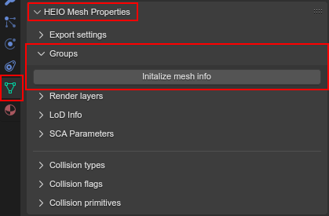
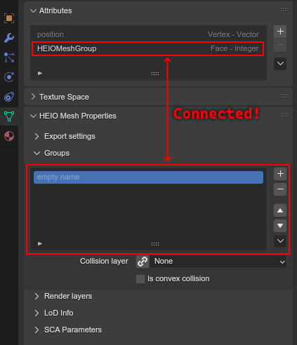
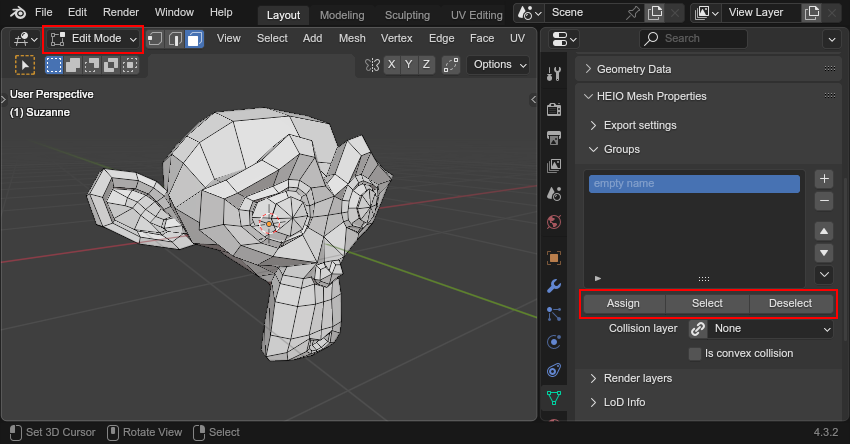
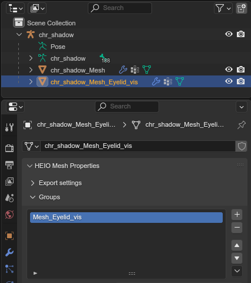
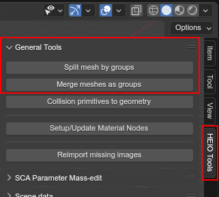
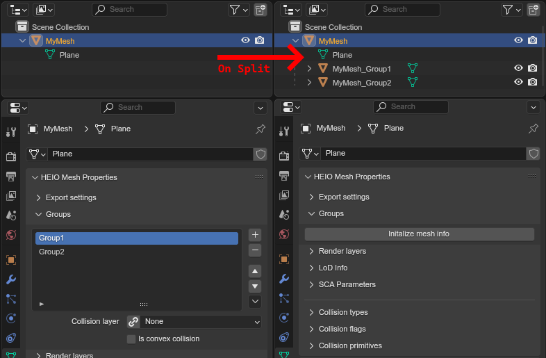

:og:description: Working with mesh groups
:og:image: _images/index_mesh_groups.png

###########
Mesh Groups
###########

Mesh groups are used to divide a model into seperate units, which have multiple applications in
HEIO.

How do they work?
=================

Very similar to materials, mesh groups are used to assign polygons of a mesh to a (named) unit.

Where are they used?
====================

Mesh groups are used for 2 things:

- As literal mesh groups in ``.model`` and ``.terrain-model`` files
- As "shapes" in ``.btmesh`` files; Read more :doc:`here <collision_mesh_editing>`

Editing mesh groups
===================

Setup
-----

When first opening the groups subpanel you are met with a button that says "Initialize mesh info"
(unless it's an imported mesh that already had groups):

	Where to find the mesh groups subpanel

Pressing it will do 2 things:

- A single type slot will be created in the list (as the list needs at least one entry to make sense)
- A new mesh attribute gets added by the name of ``HEIOMeshGroup``

The attribute group is responsible for assigning each polygon which group slot is used, so don't
delete it!

	The mesh group list and the mesh attribute that it relies on

Editing the list
----------------------

You can add, remove and move slots. A polygon connects to the same slot, even after it is moved.
The group name can be edited by double clicking it.

Assigning polygons to a group
-----------------------------

Just like materials, you can edit a polygons mesh group by entering edit mode. This will make
three operators visible below the list, which act 1:1 how they do for materials, but for the
mesh groups instead:

- ``Assign`` will assign all selected polygons to the selected mesh group slot
- ``Select`` will select all polygons assigned to the selected mesh group slot
- ``Deselect`` will deselect all polygons assigned to the selected mesh group slot

	The three type editing operators visible below the group list

Deleting group info
^^^^^^^^^^^^^^^^^^^^^^^^^^

You can delete the group mesh info entirely by opening the context menu (button at the
bottom right of the list) and clicking ``Delete mesh info`` to delete the list and attribute.

On import
=========

``.model`` files
----------------

If a ``.model`` file contains multiple mesh groups, then each is imported as a separate mesh object
under the armature.

	``chr_shadow.model`` from Shadow Generations, which places the Eyelids in a seperate mesh group

Mesh groups on a model with only an empty name are left uninitialized.

``.terrain-model`` files
------------------------

Terrain models, if one had multiple mesh groups, would all import into one mesh.
Those with only an empty name are left uninitialized.

However, no terrain model ever used mesh groups, which is why all of them import without anymesh
group data.

``.btmesh`` files
-----------------

Collision meshes, while they don't use named mesh groups like models, are divided into "shapes",
which are very similar on a technical level. To avoid making another data set that just does the
same, shapes simply get imported as mesh groups.

You can learn more in the :doc:`collision mesh editing guide <collision_mesh_editing>`.

Mesh group Splitting
====================

HEIO provides two operators for working with mesh group geometry:

- :ref:`Split mesh by groups <bpy.ops.heio.split_meshgroups>`
- :ref:`Merge meshes as groups <bpy.ops.heio.merge_submeshes>`

	Where to find the split and merge operators

With those you can split a mesh into multiple meshes and merge them back together by their mesh
groups. The new meshes will be added as children to the original object to retain the object tree
structure and still make for a valid import.

.. note::
	When merging a mesh with children that have the same mesh group, then the resulting mesh will
	have the same mesh group twice, as opposed to being combined.

	Exporting a model will combine them, while for collision meshes they will count as separate
	shapes.

	A mesh with two mesh groups being split