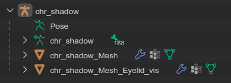
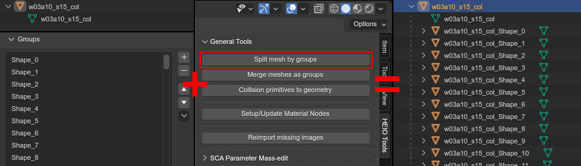
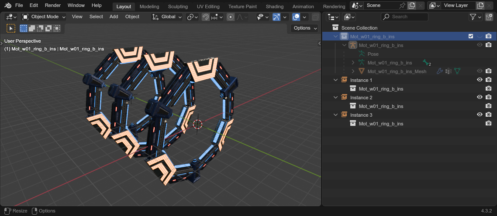

############
Object Trees
############

"Object trees" are a system by which HEIO determines which objects & meshes make up a model file.

Understanding these will allow you to make full use of the exporters, especially when creating
stages with point clouds.

What is an "object tree"?
=========================

An object tree is a collection of objects, usually with a root object that is the final parent to
all objects in the tree.

What counts as a "Mesh"?
------------------------

There are 4 object types that are considered for their mesh data:

- Meshes
- Curves
- Surfaces
- Texts

Metaballs are **not** considered for their merging behavior, which combines multiple objects
into one and thus breaks the core functionality behind object trees. If you want to export
metaball models, you must convert them to meshes by hand.

Types of object trees
=====================

Rooted trees
------------

Rooted trees are the default type of object tree, which consists of at minimum the "root" object,
but can  also have an arbitrary number child objects.

HEIO imports ``.model`` files as rooted trees with children, where the armature is the root object
which has at least 1 mesh object as a child. If a ``.model`` has more than one mesh group, each
mesh group gets imported as its own mesh object:

	The object tree of ``chr_shadow.model`` from Shadow Generations

Meanwhile ``.terrain-model`` files, while they can have more than one mesh group, are always
imported as a single mesh to make reusing the same mesh in a stage project easier (and also
because there exists not a single ``.terrain-model`` file with more than one mesh group):

	The object tree of ``w01_fararkparts_a_ins.terrain-model`` from Shadow Generations

The same goes for ``.btmesh`` files, aka collision meshes; Their shapes are imported as
individual mesh groups, but are all kept in one mesh for the same reason as terrain models.

Splitting a rooted model
^^^^^^^^^^^^^^^^^^^^^^^^

Yet, you can split a mesh that consists of multiple mesh groups up into multiple meshes, which
are added as child objects to the object that was split, by using the
:ref:`Split mesh by groups <bpy.ops.heio.split_meshgroups>` operator:

	The collision mesh ``w03a10_s15_col.btmesh`` from Shadow Generations being split by its mesh groups.

You can also merge them back together using the :ref:`Merge meshes as groups <bpy.ops.heio.merge_submeshes>` operator.

Rootless trees
--------------

Rootless trees, while not recommended, are possible. These are object trees that essentially consist of
multiple object trees, and thus don't have a single root.

There are only 2 circumstances under which a rootless tree is used:

1. When exporting models with the ``Merge`` mesh mode, instead of the ``Seperate`` mesh mode
2. When an instance collection has more than one object tree (see below)

Instance collection trees
-------------------------

Instance collections are used for easily reusing object trees, especially useful when an object
tree contains more than just the root:

	The model ``Mot_w01_ring_b_ins.model`` from Shadow Generations being used multiple times by collection instances.

If a collection has only one object tree, then that tree is used as is. Otherwise, the trees in the
collection get interpreted as a rootless object tree.

Point clouds import ``.model`` files as instance collections by default for convenience.

Object tree naming
==================

Each unique object tree in an project results in one exported file, where the name gets derived from the
object tree itself.

These are the rules to obtaining the object trees name:

- If an object tree...
	- ... is an instance collection, use the collection name
	- ... has a root...
		- ... that has data (mesh, armature, curve, etc.), use the data name
		- ... and above does not apply, use the root object name
	- ... has no root...
		- ... and uses merged model export, use the specified filename
		- ... and above does not apply, throw an error

.. important::

	**"What happens if multiple object trees have the same name?"**

	In this case, the first object tree to have been assigned the name will be used.

Rooted properties
=================

On export, most properties of each part of an object tree is retained. However, some properties
are specifically being sourced from root objects, being:

- :doc:`LoD info </user_interface/object/lod_info>`
- :doc:`Mesh SCA Parameters </user_interface/object/sca_parameters>`
- Armature bones.

If any of this info is on the child of a root object, or part of a rootless tree, it will be lost.