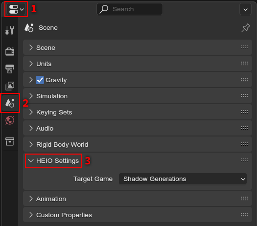

.. _guides-project-setup:

#############
Project setup
#############

Setting up a new project is very simple, and only involves changing the :ref:`target game <bpy.types.HEIO_Scene.target_game>` right now.

	This is where you can find the project settings

| You can change the target game under
| :menuselection:`Properties --> Scene --> HEIO Settings --> Target Game`

.. container:: lead

   .. clear

.. note::

	These properties are configured per scene! If you create a new scene in the same file, make
	sure to set the target game there too