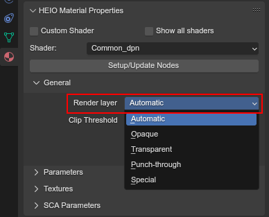
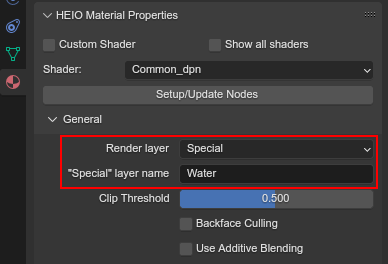
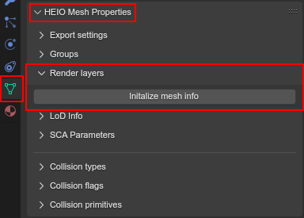
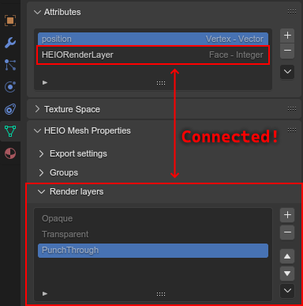
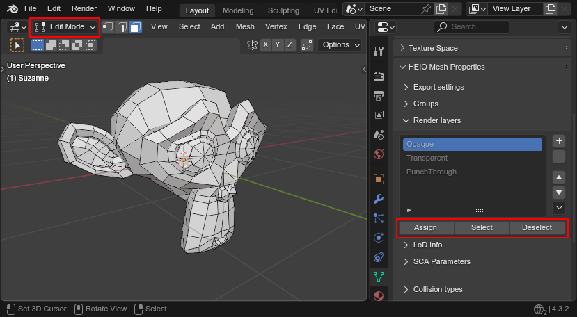
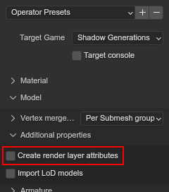

:og:description: Render layers explained
:og:image: _images/index_render_layers.png

#############
Render Layers
#############

Render layers determine how and when a mesh is rendered.

Where are they used?
====================

They are stored in ``.model`` and ``.terrain-model`` similar to how materials are stored.

Which render layers exist?
==========================

There are three "main" render layers:

- Opaque: Meshes are rendered without any transparent elements
- Transparent: Meshes are rendered fully transparent (sorted by distance to camera)
- Punch Through: Like opaque, but pixels are "clipped" when rendering if the output color ends up with an alpha below the clip threshold

It's also possible to set a custom "special" render layer, like "Water" (used in Sonic Generations).

Changing the render layer
=========================

There are two methods to changing the render layer:

Materials
---------

The easiest way the changing a meshes the render layer is by specifying it in each material.

Materials themselve don't actually store the render layer, but are paired with materials in meshes,
which is then used when exporting a ``.model`` or ``.terrain-model``.

A materials render layer can be changed in the ``General`` subpanel of the ``HEIO Material
Properties`` panel:

	Where to change a materials render layer

Automatic
^^^^^^^^^

When set to automatic the render layer will be using the default render layer specified for the
used shader. If the shader is not registered for the target game ``Opaque`` is used.

Special
^^^^^^^

When using ``Special`` a new text field will appear that lets you input the name of the special
render layer:

	Example for a special layer name in a material

Mesh info
---------

In the rare event that you want to use different render layers on the same material, you can do so
by specifying the render layer per-polygon (like :doc:`mesh groups <mesh_groups>`).

These override the render

Setup
^^^^^

When first opening the render layer subpanel you are met with a button that says "Initialize mesh
info" (unless you imported the mesh with render layer attributes):

	Where to find the render layer subpanel

Pressing it will do 2 things:

- The three main render layers will be created (which cannot be moved or removed)
- A new mesh attribute gets added by the name of ``HEIORenderLayers``

The attribute group is responsible for assigning each polygon which render layer slot is used, so
don't delete it!

	The render layer list and the mesh attribute that it relies on

Editing the list
^^^^^^^^^^^^^^^^

The three default slots cannot be renamed, moved or removed.

Every additional layer is a special layer, which you can rename, move and remove. The name can be
changed by double clicking it.

A polygon connects to the same slot, even after it is moved.

Assigning polygons to a layer
^^^^^^^^^^^^^^^^^^^^^^^^^^^^^

Just like materials, you can edit a polygons render layer by entering edit mode. This will make
three operators visible below the list, which act 1:1 how they do for materials, but for the
mesh groups instead:

- ``Assign`` will assign all selected polygons to the selected render layer slot
- ``Select`` will select all polygons assigned to the selected render layer slot
- ``Deselect`` will deselect all polygons assigned to the selected render layer slot

	The three type editing operators visible below the render layer list

Deleting render layer info
^^^^^^^^^^^^^^^^^^^^^^^^^^

You can delete the render layer mesh info entirely by opening the context menu (button at the
bottom right of the list) and clicking ``Delete mesh info`` to delete the list and attribute.

On import
=========

When importing a model, materials will automatically receive the layer that is part of the mesh
segment they are assigned to.

If two segments share a material but not the same render layer,
then the render layer further down in the dropdown list is chosen (e.g. if one is ``Opaque`` and one
is ``Transparent`` then ``Transparent`` is chosen).

To import the render layers as mesh info attributes, toggle ``Create render layer attributes`` in
the import settings:

	Where to find the import setting