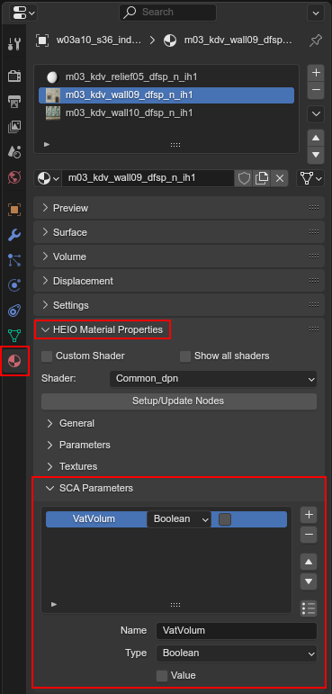

#####################
SCA Parameter editing
#####################

SCA (\ **S**\ ample \ **C**\hunk \ **A**\ttribute) parameters are freeform information attached to
files that make use of the Sample Chunk V2 file layout.

Where are they used?
====================

Games
-----

Sonic Lost World was the first game to use the Sample Chunk V2 file layout, and every Hedgehog
Engine game since uses it for certain file types.

File types
----------

Currently there are only 3 file types that actually make use of SCA parameters:

- ``.model``
- ``.terrain-model``
- ``.material``

These files use SCA parameters for various additional settings that affect how the file is read,
how the contents are displayed ingame and more.

.. note::

	``.model`` files store SCA parameters for each bone in the model!

Where to edit them for...
=========================

... Armature bones
------------------

These are used when exporting ``.model`` files.

	Where to find the SCA parameter panel for armature bones

... Meshes
----------

These are used when exporting ``.terrain-model`` files.

.. important::
	Only the SCA parameters stored on the :ref:`root object <guides/object_trees:Rooted Trees>` are used!

.. figure:: images/sca_parameter_editing_mesh_panel.png

	Where to find the SCA parameter panel for armature bones

... Materials
-------------

These are used when exporting ``.material`` files.

	Where to find the SCA parameter panel for armature bones

Parameter properties
====================

The SCA Parameter editor has a list which can have as many entries as you'd like to add.

Each parameter has 3 properties:

- A name that with a maximum lenth of 8
- A type (``Integer``, ``Float`` or ``Boolean``)
- A Value

The type
--------

The type is special, as it solely exists in HEIO and is not actually stored in the exported files.

When changing the type, the internal value remains the same, like let's say the type of a
parmaeter is ``Boolean`` and the checkbox is toggled on; Changing that parameter to ``Integer``
now will swap the checkbox to a number field, with the number being "1", as these two values
represent the same bytes.

When importing a file the game compares every SCA parameter against a list to see if the name has
a type associated with it, and uses that type if so. These types are defined per target game,
e.g. Shadow Generations has a material SCA parameter ``VatVolum`` which HEIO finds to be a
``Boolean``.

If the same file was imported for e.g. Sonic Frontiers the type would remain at the default type
of ``Integer``, as that game does not use such an SCA parameter.

.. note::

	These name-type combinations are found and documented manually, which means its not impossible
	for one to have been documented with the wrong type!

	If you have proof that this happened, please open a
	`github issue <https://github.com/hedge-dev/HedgehogEngineBlenderIO/issues>`_!

Presets
=======

As mentioned above, each target game has pre-defined SCA parameters that are used for assigning the
correct types when importing, but these can also be used for creating new parameters!

To create a new parameter from a preset, click the bottom to the bottom right of the list, then
select a preset from the list and confirm:

	How to create a new SCA parameter from a preset; Presets shown are for Shadow Generations materials

Automatic SCA parameters
========================

Some games are found to have the same SCA parameters across the majority (if not all) files, which
you might want to add to your exports as well. To make this easier, HEIO can automatically add the
missing "default" parameters when exporting:

	The automatic SCA parameter export settings

Just like presets, these are defined per target game, e.g. Shadow Generations exports models with
the following parameters for each bone:

- ``GIOcclus`` with the boolean value ``true``
- ``TerrainB`` with the boolean value ``false``
- ``ColorMas`` with the boolean value ``false``

Editing multiple SCA parameter lists at once
============================================

Adding and configuring every SCA parameter for every model manually can become very tiring very
fast, which is why HEIO provides a mass-edit tool for that! You can find them in the 3D viewport
toolbar:

	Where to find the SCA parameter mass-edit tool

To use it, first set the ``Mode``, which determines which SCA parameter lists are affected:

- ``Model`` in object mode: Mesh objects
- ``Model`` in pose mode: Armature bones
- ``Material``: Materials on mesh objects

Next set up the SCA parameter; You can also use presets here by toggling the preset button to the
right of the parameter name, which replaces the name field with a dropdown and locks the type.

Now you have 4 operators at your disposal:

Select
	Select all objects/bones that contain the targeted parameter name.

Select exact
	Select all objects/bones that contain the targeted parameter name and specified value (value type not checked).

Set
	Add or update the targeted SCA parameter (by name) on all selected objects/bones.

Remove
	Remove the targeted SCA parameters (by name) with the same name on all selected objects/bones.
