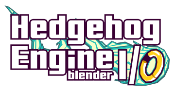

%%%%%%%%%%%%%%%%%%%%%%%%%%%%%%%%%%%%%%%%%%%%%%%%%%%
Hedgehog Engine I/O |HEIO_VERSION| Reference Manual
%%%%%%%%%%%%%%%%%%%%%%%%%%%%%%%%%%%%%%%%%%%%%%%%%%%

Welcome to the Hedgehog Engine Blender I/O, or short **HEIO**, addon manual! This manual includes
setup guides, UI documentation and more to work with Hedgehog Engine 3D related file formats!

HEIO supports 7 Hedgehog engine games by default:

- Sonic Unleashed
- Sonic Generations
- Sonic Lost World
- Sonic Forces
- Sonic Origins
- Sonic Frontiers
- Sonic X Shadow Generations

Getting Started
===============

.. only:: builder_html and (not singlehtml)

    .. container:: toc-cards

        .. container:: card

            :doc:`/getting_started/about`

        .. container:: card

            :doc:`/getting_started/installation`

        .. container:: card

            :doc:`/getting_started/contact`

.. container:: global-index-toc

    .. toctree::
        :caption: Getting Started
        :maxdepth: 1

        getting_started/about
        getting_started/installation
        getting_started/contact

Sections
========

.. only:: builder_html and (not singlehtml)

    .. container:: toc-cards

        .. container:: card

            .. figure:: /images/index_user_interface.png
                :target: user_interface/index.html

            :doc:`/user_interface/index`
                All new panels and tools added by HEIO

        .. container:: card

            .. figure:: /images/index_guides.png
                :target: guides/index.html

            :doc:`/guides/index`
                Learn how to perform basic tasks with the addon

        .. container:: card

            .. figure:: /images/index_tutorials.png
                :target: tutorials/index.html

            :doc:`/tutorials/index`
                Step-by-step walkthroughs for creating mods with HEIO

        .. container:: card

            .. figure:: /images/index_material_templates.png
                :target: material_templates/index.html

            :doc:`/material_templates/index`
                Status on material templates for all game shaders

        .. container:: card

            .. figure:: /images/index_target_configuration.png
                :target: target_configuration/index.html

            :doc:`/target_configuration/index`
                Configuring target games for HEIO

.. container:: global-index-toc

    .. toctree::
        :caption: Sections
        :maxdepth: 2

        /user_interface/index
        /guides/index
        /tutorials/index
        /material_templates/index
        /target_configuration/index