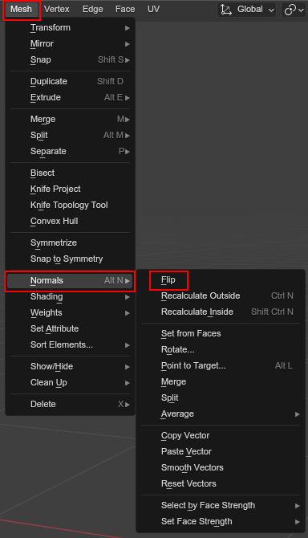

############################################
Tutorial 2: Shadow Generations character mod
############################################

Welcome to the second beginner tutorial for Shadow Generations modding!

Here you will learn the basics of how to modify and create your own character mod (changing
the model of Shadow).

.. attention::

	This is a continuation of the :doc:`first beginners tutorial <shadow_gens_stage_mod>`.
	While that one focusses on stage modding, it teaches all the essentials of working with HEIO!

	Also this tutorial expects you know how to work with armature weights!

Part 1: Preparing the files
===========================

Once again, lets create our mod and prepare the files first.

Create a new mod, i'll call mine "HEIO Tutorial 2".

Next, we need to unpack and copy the files for Shadows character model. The archive we are looking
for is ``/image/x64/raw/character/shadow.pac``.

Part 2: Importing the files into blender
========================================

The file we want to import is ``chr_shadow.model``. Before importing, don't forgot to make sure
your blender project scene has the correct target game of ``Shadow Generations``!

Also toggle the system console to see the import progress.

Now open the ``.model`` importer:

.. figure:: /guides/images/asset_importing_model.png

	Where to find the model importer

After importing Shadow should be t-posing in all his glory:

	The imported Shadow model

One thing you should notice is that the model is split up into 2 different meshes:

	The different meshes that got imported

This is because the eyelids belong to a mesh group called ``Mesh_Eyelid_vis``, which the game uses
to hide the eyelids when not needed. We'll go over the details of that later, let's focus on the
model itself for now.

Part 3: Replacing the model
===========================

At it's core, making a character mod is very simple: All we need to do is exchange the model(s)
attached to the armature. I won't go over the process of weight painting in this tutorial, as that
is a fairly standard procedure in blender and has numerous tutorials available online.

As such, which model you use is up to you. I will be using Mario from Mario 64 for it's simplicity,
which i got from `The Models Resource <https://www.models-resource.com/nintendo_64/supermario64/model/1637/>`_.

Armature Bones
--------------

Now, one thing to keep in mind is that you should **not** move the bones. While you certainly _can_
do it, it's better not to, as the games animations are absolute and will move the bones back
to the same positions as they were before, which is gonna stretch and deform your model in ways
that you may not want to.

In other words, make the model fit the armature, not the other way around.

Eyelids
-------

As mentioned before, eyelids are a special case. If you end up adding eyelids to your character
mod, you must make sure to assign it to the correct mesh group!

You can either have the eyelids be part of the rest of the model, or be seperate, both works.

To assign the mesh group, open the ``HEIO Mesh Properties`` panel in the ``Mesh Properties``:

.. figure:: /guides/images/mesh_groups_initial.png

	The mesh groups panel

Unless you used a mesh that HEIO imported with mesh groups, you should see a button saying
"Initialize mesh info". Press that button. Now you should be able to edit the list.

If the eyelid is on a seperate mesh all by itself, just rename the already existing mesh group
to ``Mesh_Eyelid_vis``.

If the eyelids are part of the same mesh as the rest of the character, add a new mesh group and
name that to ``Mesh_Eyelid_vis``. Now enter edit mode; This should add three new, yet familiar
buttons:

.. figure:: /guides/images/mesh_groups_editing.png

	The edit operators for mesh groups

Now, just like for materials, select the mesh group for eyelids, then select all polygons that
belong to the eyelids and press the assign ``Assign`` button below the mesh groups list. That's it!

Materials
---------

When creating materials, it's best to look at imported materials for reference. You may notice a
pattern with some materials, like how characters usually use ``ChrAlbedoFalloff`` for regular
character materials.

For my mario model, i simply used a ``ChrAlbedoFalloff_dpn`` shader for the clothes,
and a ``ChrSkinCDRF_dpncf`` shader for the face (only place showing skin).

You'll need to experiment a bit with the falloff parameters to get them how you like.

Some useful resources for learning how to work with materials:

- `Physically based rendering in HE2 <https://hedgedocs.com/index.php/Hedgehog_Engine_2_-_Physically_Based_Rendering_(PBR)>`_
- `HE2 textures <https://hedgedocs.com/index.php/Hedgehog_Engine_2_-_Textures>`_
- `Shadow Generations Shader documentation <https://hedgedocs.com/index.php/Shadow_Generations_Shaders>`_

.. attention::

	As of writing this, not all shaders have material templates and will look inaccurate in
	blender! For those, you will need to verify that they look good ingame.

Part 4: Exporting & ingame testing
==================================

Once your model is prepared, it's time to bring it ingame!

	The model i prepared (armature is hidden)

To do so, let's set up a collection operator again! Select the collection that the model imported 
with and add a ``.model`` exporter to it that exports to a ``dummy.model`` file in your
mods ``shadow`` directory:

.. figure:: images/shadow_gens_chr_mod_exporter.png

	The exporter setup

Now press export, then convert your mods ``shadow`` directory to a .pac file and hop ingame; Your
model should now replace Shadow:

	Lanky Mario in all his glory

Part 5: Insufficient Aura
=========================

While playing, you might notice that the chaos control aura model is still a silhouette of Shadow:

.. figure:: images/shadow_gens_chr_mod_aura.png

	The broken aura

This is because it's stored in a different model file: ``chr_shadow_aura.model``. Let's import it
into our project and see what we can do!

After importing, we can see it's just a model of shadow, but "thicker":

.. figure:: images/shadow_gens_chr_mod_import_model_aura.png

	The imported aura model

The aura armature is very similar, but still different in many parts. Many bones from the
regular model are absent, and some are transformed very differently.

Yet, these bones missing is actually not a problem! We can copy paste our regular armature and
mesh, rename the ``chr_shadow`` bone to ``chr_shadow_aura`` and the ``mesh`` bone to ``L_mesh``
and it will work perfectly fine!

.. attention::
	**VERY IMPORTANT**: Rename the duplicated armature data from ``chr_shadow.001`` to
	``chr_shadow_aura``, as this is what determines the exported file name!

	.. figure:: images/shadow_gens_chr_mod_aura_name.png

		Where to change the armature data name

Now just make the model "thicker" and swap out the materials with the imported aura material
``chr_shadow_aurabody`` and the model is ready for the game.

.. hint::
	You can make a model "thicker" using the
	`"Shrink/Flatten operator <https://docs.blender.org/manual/en/4.3/modeling/meshes/editing/mesh/transform/shrink-fatten.html>`_
	(``ALT + S``)

Now you just need to add the armature and duplicated model to the export collection, export and
convert the directory again. The regular and aura models should have gotten exported to separate
files, and should now both be ingame:

	The exported aura model

Okay, that is still not looking right. That is because we have to invert the normals of the model!

Simply enter edit mode of the aura model, select all polygons and
`flip the normals <https://docs.blender.org/manual/en/4.3/modeling/meshes/editing/mesh/normals.html>`_:

	Where to find the flip normals operator

You can check whether they are flipped by enabling ``Face Orientation`` in the viewport overlay.
Blue means outward ("correct"), while red means inward ("flipped"):

.. figure:: images/shadow_gens_chr_mod_face_orientation.png

	Where to find the face orientation viewport setting

Now: export, convert to ``.pac`` and boot up the game; The aura should no longer hide your model:

.. figure:: images/shadow_gens_chr_mod_aura_fixed.png

	The flipped aura ingame

.. note::

	This works because the aura material has backface culling enabled. If it were not enabled, then
	the aura would still look "solid", even when flipped.

Part 6: So longe' bowser!
=========================

That's it, now your character mod should be done! Congrats!

.. figure:: images/shadow_gens_chr_mod_result.png
	:figwidth: 70%

	The finished Mario model, posing on the results screen

This knowledge does not just apply to character models, but to all kinds of models in every
hedgehog engine game!

Generally, when it comes to making model mods its important to know your way with materials. The
better your material game, the better your mods! Go wild experimenting with different shaders and
parameters! You can learn more about shaders, textures and related topics over at hedgedocs
(`HE2 Engine documentation <https://hedgedocs.com/index.php/Hedgehog_Engine_2_Rendering>`_,
`Shader documentation <https://hedgedocs.com/index.php/Shadow_Generations_Shaders>`_)

If you want to learn more about how HEIO works, check out the :doc:`Guides </guides/index>`
section!

With that said, i hope you found this tutorial helpful (again)! If you still have questions you can
join the `Hedgehog Engine Modding Discord Server <https://dc.railgun.works/hems>`_.