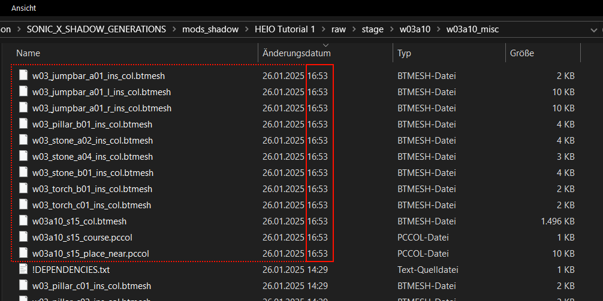
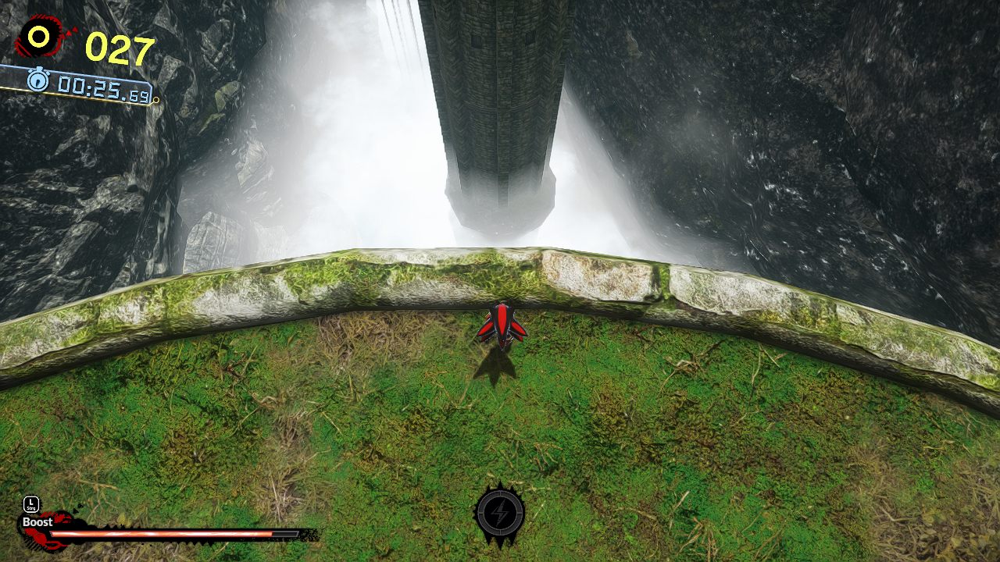
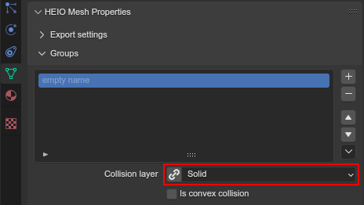

########################################
Tutorial 1: Shadow Generations stage mod
########################################

Welcome to this beginner tutorial for a Shadow Generations stage mod!
Here you will learn the basics of how to modify and create your own stage geometry for Shadow
Generations!

In this example, we will modify Kingdom Valley Act 1.

Let's get started then, shall we?

.. attention::

	This tutorial expects you know about the basics of working with blender!

	This includes:

	- Navigating the blender UI
	- Understanding and working with...
		- Collections
		- Objects (creating, moving, organizing, etc)
		- Object properties
	- How blender materials work

Part 0: The tools
=======================

Before we begin, you should make sure you have all the tools needed:

- :doc:`Installing HEIO </getting_started/installation>` for... well, HEIO
- `HedgeArcPack <https://hedgedocs.com/tools/hedgehog-engine/common/files/>`_ for unpacking and packing archive files
- `HedgeModManager <https://github.com/thesupersonic16/HedgeModManager>`_ for running the mod
- `Sonic X Shadow Generations <https://store.steampowered.com/app/2513280>`_ (should be obvious why)

Part 1: Preparing the files
===========================

First, you will want to prepare the files needed for the mod to run in the first place.

Creating the mod
----------------

Before we touch any files, let's first create the mod that will hold all the final files:

1. Open HedgeModManager
2. Select Shadow Generations
3. Click the "Add Mod" button
4. Select "Making one (for developers!)"
5. Enter your name in the "Author" field and change the title to "HEIO Tutorial 1" (or whatever you want it to be named)
6. Press "Ok"

This should create and open a new directory for your mod, where we will put the files needed to get
everything working.

Which files?
------------

Open the directory in which SXSG is installed. The easiest way to do this is by right
clicking the game in your steam launcher, going to "manage" and clicking "Browse local files".

.. figure:: images/shadow_gens_local_files.png

	How to open the directory where SXSG is installed

Shadow Generations stores all stage specific files under ``/image/x64/raw/stage``, so navigate
there. Inside that directory, you are met with many more directories and ``.pac`` files, but none
of them are named after the actual stage names! what now?

Sonic Team organizes the stage by the zone and act (or challenge) numbers, which are documented
`here <https://hedgedocs.com/docs/hedgehog-engine/miller/levels/ids/>`_. Going by that list,
Kingdom Valley Act 1 should be stored under ``w03a10``.

Inside that directory you will find more ``.pac`` files, which is exactly what we are looking for!
These are like ``.zip`` files invented by Sonic team, and they are optimized for faster reading
to reduce loading times ingame.

For now, let's focus on the visual terrain of the stage. Sonic Team stores that in ``_trr_s##``
files, of which we have one here: ``w03a10_trr_s00.pac``!

To open it, we use **HedgeArcPack**. Simply drag and drop the ``w03a10_trr_s00.pac`` onto
``HedgeArcPack.exe`` and voilá! Now we can access the files inside!

But before we continue, you should copy the unpacked directory to your mod directory- but not just
into the mod directory itself! It should be put inside the same relative directory to the ``raw``
directory! Create the directories necessary in your mods ``raw`` directory, and then copy the unpacked
``w03a10_trr_s00`` directory into it:

	Where to copy the unpacked directory

Part 2: Importing the files into blender
========================================

Next, we should import the terrain files into blender, but which files actually belong to
the terrain? Well:

- ``.terrain-model``: Stores models exclusively used for terrain geometry
- ``.model``: Geometry that, while usually reserved for interactive objects, may also be used for stage terrain.
- ``.material``: Geometry material information
- ``.dds``: Image textures
- ``.pcmodel``: "Point clouds" that store which models are placed where in the stage.

Importing stage geometry
------------------------

While each of these can be loaded individually, we are interested in the ``.pcmodel`` files. So
let's try importing one into blender!

First, make sure your blender project scene has the correct target game of ``Shadow Generations``:

.. figure:: /guides/images/project_setup.png

	Where to change the target game

Next make sure you can see the console output! You will find out why later:

.. figure:: images/shadow_gens_stage_mod_toggle_console.png

	How to toggle the console

Now open the ``.pcmodel`` importer:

.. figure:: /guides/images/asset_importing_pointcloud.png

	Where to find the point cloud importer

There, navigate to the originally unpacked ``w03a10_trr_s00`` directory, **NOT THE COPY IN YOUR
MOD**; You should find multiple ``.pcmodel`` files, and while HEIO *can* import multiple at once,
we should import just two for now.

Choose the files ``w03a10_s15_place_near.pcmodel`` and ``w03a10_s15_course.pcmodel`` and confirm.

The import process may take a while, which is what we opened the console for: HEIO prints a status
bar to the console to make waiting a bit more bearable:

.. figure:: images/shadow_gens_stage_mod_console_output.png

	The importer status in the console

Once the importer is finished you are met with- Wait, what is that? 10 Files could not be found?
Oh no! What now??

Working with dependencies
-------------------------

After importing, you will (probably) be met with a text popup that says the following:

.. code-block:: none
	:emphasize-lines: 1

	10 files could not be found.
	(You can attempt to reimport images using the "Reimport missing images" operator found in the viewport tools)

	Some files may be located in the following archives and need to be unpacked:
		C:\Program Files (x86)\Steam\steamapps\common\SONIC_X_SHADOW_GENERATIONS\image\x64\raw\stage\w03a10\w03a10_trr_cmn.pac

	List of unresolved files:
		m03_kdv_relief05_dfsp_n_ih1.material
		m03_kdv_brick15_dfsp_y_ih1.material
		m03_kdv_bridge04_dfsp_r_ih1.material
		m03_kdv_pillar01_dfsp_z_ih1.material
		m03_kdv_bridge10_dfsp_z_ih1.material
		m03_kdv_bridge11_dfsp_z_ih1.material
		m03_obj_door03_sphere_nk1.material
		w03_kdv_bridge11_dfsp_z_ih1_abd.dds
		w03_kdv_bridge11_dfsp_z_ih1_prm.dds
		w03_kdv_bridge11_dfsp_z_ih1_nrm.dds

	2 images are streamed and could not be loaded, either because the streaming package (.ntsp file) was not found, or because the streaming package does not contain the texture that is being looked for.
	Please make sure that the NTSP filepath in the addon configuration is correctly set.
	You can attempt to reimport images using the "Reimport missing images" operator found in the viewport tools.

	Following streaming packages were not found altogether:
		w01_stage.ntsp
		w03_stage.ntsp

	List of missing streamed images:
		w01_dummytex_white_abd
		w03_kdv_wall05_dfsp_z_ih1_abd

Unfortunately, importing the stage won't be that simple. Not all files for the stage are in a single
``.pac`` archive, and some images are streamed.

Fortunately, HEIO tells us exactly what we need to do: ``w03a10_trr_s00.pac`` contains a
dependency to ``w03a10_trr_cmn.pac``, the solution? Unpack it too!

Go back to the directory where you unpacked ``w03a10_trr_s00.pac`` and unpack
``w03a10_trr_cmn.pac`` too.

This will now find all missing files for ``w03a10_s15_place_near.pcmodel``, but some terrain models
use materials even higher up in the dependency tree. To avoid constantly reimporting, open the
``!DEPENDENCIES.txt`` file inside ``w03a10_trr_cmn``:

.. code-block:: none

	stage\w03_common

As you can see, it references ``w03_common.pac`` that is found a directory further up. Let's
unpack that too! And inside there, you will see it depends on ``EffectCommon``, but we can ignore
that, as it is for effect textures, which the stage geometry does not use.

Lets revert our previous import with ``CTRL + Z`` and import the two ``.pcmodel`` files again!
Aaaaaand... Oh no! we still could not load some images! Is the addon broken??

Loading streamed textures
-------------------------

No, the addon is working just as it should, we just forgot to set up texture streaming.

To reduce time spent reading many medium sized files, Shadow Generations stores many textures
inside texture streaming packages. You can find them in the ``image/x64/raw/texture_streaming``
directory:

.. figure:: images/shadow_gens_stage_mod_texture_streaming.png

	The texture streaming directory

In order for HEIO to load them, all we need to do is open the addon preferences and fill the path
to the ``texture_streaming`` directory into the ``NTSP Directory`` property for Shadow Generations:

.. figure:: /guides/images/addon_config.png

	Where to find the addon preferences

Now, all we need to do is run the :ref:`Reimport missing images <bpy.ops.heio.reimport_images>` operator inside the
``w03a10_trr_s00`` directory:

.. figure:: images/shadow_gens_stage_mod_reimport_images.png

	Where to find the reimport missing images operator

After it has finished running, there should be no popup, which means all relevant files were
imported now! Hooray!

Part 3: Editing the stage terrain
=================================

Now that we have everything we need, lets do some editing!

Blender preview
---------------

But first, let's look at the imported stage in all it's glory by enabling viewport shading. Doing
so will reveal some weird, textureless geometry that is not seen ingame:

.. figure:: images/shadow_gens_stage_mod_shadow_casters.png

	Texturesless geometry that is not visible ingame

As you can see, they match the rough shape of the rock cliffs, which has a good reason: The actual
cliffs are configured to not cast shadows, which is instead done using this "shadow caster"
geometry!

.. tip::
	If you want to hide them, or put them in a sub-collection (which HEIO allows) then you can do
	so easily; All of these (should) have the same material, which means you can select
	one of them and then automatically select the rest by using
	:menuselection:`Select --> Select Linked --> Material`:

	.. figure:: images/shadow_gens_stage_mod_hide_shadow_casters.png
		:figwidth: 70%

		Where to find the select linked operator

Placing terrain
---------------

Let's try placing terrain now! How about we copy and paste one of the towers at the beginning?

Select these 4 objects (there is a shadowcaster object hidden inside the top object):

.. figure:: images/shadow_gens_stage_mod_tower_objects.png

	The objects to select

Now duplicate them using the
`Duplicate Linked <https://docs.blender.org/manual/en/latest/scene_layout/object/editing/duplicate_linked.html>`_
operator (``ALT + D``) so that we reuse the same terrain models and place them right after the
previous tower in the stage:

.. figure:: images/shadow_gens_stage_mod_tower_objects_duplicated.png

	The duplicated geometry moved to a new position

Bringing the changes to the game
--------------------------------

Next, let's bring this new tower to the game, shall we?

First, you must create a new collection with the name ``PCMODEL Collections`` and move the two
imported collections into it:

.. figure:: images/shadow_gens_stage_mod_tower_pcmodel_collection.png

	How to organize the collections

Next, set up a collection exporter on the ``PCMODEL Collections`` collection that uses the
``Collections as HE Point clouds`` exporter:

	How to create the collection exporter

You will want to configure two things in the exporter:

1. The filepath should point to a ``dummy.pcmodel`` files **in your mods w03a10_trr_s00 directory**. This file won't actually be exported, but blender demands you input the path to a file for the exporter to work, so we abide by that demand.
2. Disable ``Write Resources`` in the ``Point Cloud`` panel. This prevents any ``.terrain-model`` files and similar from being written, and only actually writes the ``.pcmodel`` files. We do this because we did not actually modify or add any new terrain models, and so we can save ourselves the time of exporting those again and just use the ones already in the directory.

.. figure:: images/shadow_gens_stage_mod_tower_collection_exporter_setup.png

	How the exporter should roughly look

Once it's set up, hit ``Export All``! This should take less than a second.

You can verify whether the ``.pcmodel`` files have been written by going to the export directory and
sorting by the last-changed-date:

	The exported files

Preparing the files for the mod
-------------------------------

One more step that we need to do to get the changes working ingame: We have to convert the directory
back into a ``.pac`` file. Nothing easier than that! Simply drag & drop the ``w03a10_trr_s00`` in
your mod directory onto ``HedgeArcPack.exe``!

A console window will open and ask you which archive type to use, for which we use ``sxsg``. Once
entered, press enter, and the program will do its thing. After a second, you should have a fresh
``w03a10_trr_s00.pac`` file.

Testing the mod
---------------

That's it now! Start the HedgeModManager, enable the mod, and make your way into Kingdom Valley
Act 1, where you should see this:

.. figure:: images/shadow_gens_stage_mod_tower_ingame.png

	The duplicated tower object ingame

However, once you try to land on it, you promptly fall through... what went wrong? Where is the
collision?

Part 4: Editing the stage collision
===================================

Stage collision is stored in different files from stage terrain, using ``.btmesh`` and ``.pccol``
files instead.

Importing the collision files
-----------------------------

The steps here are very similar to those before:

1. Go to the original ``w03a10`` directory
2. Stage collision is stored in ``_misc`` archives, so unpack ``w03a10_misc.pac``
3. Copy the unpacked directory to your mods ``w03a10`` directory for later.
4. In your blender project, create a new ``PCCOL Collections`` collection and select it
5. Open the point cloud importer again
6. Import the ``w03a10_s15_place_near.pccol`` and ``w03a10_s15_course.pccol`` files from the unpacked ``w03a10_misc`` directory

After importing, we have a small problem: These collections have the same name as the ``.pcmodel``
collections! What now?

The answer is simple: add a ``.pcmodel`` to the name of the terrain collections, and replace the
``.001`` of the collision collections with a ``.pccol``. HEIO will not include those extensions
when exporting later:

.. figure:: images/shadow_gens_stage_mod_tower_pc_collections.png

	How the collections should now be set up

Editing the collision
---------------------

First, you should hide the PCMODEL collection, so that we can look at the collision unobstructed.
Doing so, we noticed an issue... Almost all of the collision geometry is one big mesh!

While you can edit the mesh as is, there is an easier way: We can split the mesh up by its "shapes"
using the :ref:`"Split mesh by groups" <bpy.ops.heio.split_meshgroups>` operator:

	Where to find the "Split mesh by groups" operator

To use it, simply select the big collision object with the name ``w03a10_s15_col``, then click the
split operator and confirm the popup.

To make distinguishing between the different shapes easier you can change the viewport color mode
to ``Random``, which will give every object a different color:

	The random color mode in action

Now we can simply duplicate the collision responsible for the tower and move it over to where our
duplicated terrain tower is!

.. tip::
	If you want to have the collision properly aligned with the terrain:

	1. delete the old duplicated tower
	2. select both the collision and terrain objects for the tower
	3. link-duplicate them at the same time
	4. move them over again

Et voilá, now the tower collision should stand!

.. figure:: images/shadow_gens_stage_mod_tower_collision_duplicated.png

	The duplicated tower collision

.. note::

	You won't have to merge the collision back together, it works as is! But if you want to merge it,
	do so using the merge operator (found right below the split operator).

.. hint::

	If you are interested in learning more about how collision models work  and why you can split them,
	then you can read the :doc:`HEIO Collision mesh editing guide </guides/collision_mesh_editing>`.

Setting up the exporter
-----------------------

Now, just like for the terrain, set up a collection exporter for the PCCOL parent collection.

Make sure that the filepath points to ``dummy.pccol`` in your mods ``w03a10_misc`` directory and to
set the ``Collection Type`` tp ``Collision``.

This time however, we want to leave ``Write Resources`` enabled, as we modified a mesh itself and
not the pcmodel file! Fortunately, exporting collision meshes does not occupy much time, which is
why we can do that without worry:

	How the exporter should roughly look

Now press ``Export All``. Now several files in your output directory should have been exporter:

	The exported files

.. tip::

	You can trigger all collection exporters at once using the ``Export All Collections`` operator
	in the ``File`` menu, right below the ``Export`` submenu.

Testing the mod again
---------------------

Once again, time to test the mod! Convert the ``w03a10_misc`` directory to a ``.pac`` (and the
``w03a10_trr_s00`` directory too, if you changed where the tower terrain was placed), start the
game and boot into the stage.

This time, upon jumping on the tower, you should not fall through:

	Standing on the duplicated tower object ingame

Part 5: Adding custom terrain and collision
===========================================

Time to get really spicy by adding our own terrain and collision models!

The terrain model
-----------------

Let's start with the terrain by adding our beloved Suzanne: Place the cursor on the duplicated
tower and add a new monkey model. Add a subdivision surface modifier to it to make it nice and
smooth. Make sure that the object is part of your ``w03a10_s15_place_near.pcmodel`` collection!

Next, we need to configure some SCA parameters so the model casts and receives shadows ingame.
Open the objects mesh properties, in which you open the ``HEIO Mesh Properties`` panel, in which
you open the ``SCA Parameters`` subpanel.

This subpanel has a list and 5 buttons to the right. Press the button at the very bottom and
select the ``ShadowCa`` preset and confirm. The new SCA parameter should appear in the list with
a checkbox; Toggle the checkbox on. This enables Shadow casting for the object.

Do the same for the ``ShadowRe`` preset, which enabled Shadow receiving.

.. figure:: images/shadow_gens_stage_mod_suzanne_sca_parameters.png

	How the SCA parameters should look after setting them up.

The terrain material
--------------------

Next, add a material to Suzanne and name it ``Suzanne``. In this new material, open the
``HEIO Material Properties`` panel and disable the ``Custom Shader`` property. This will
exchange the shader text field with a dropdown. In that dropdown select ``Common_d``, which
is a very simple PBR shader. Once switched press the ``Setup/Update Nodes`` button to enable
material previewing in blender.

Right now the material appears completely black - this happens because we don't have a texture.
Create a new texture in the ``Texture Paint`` workspace, name it ``Suzanne_abd``, make it 16x16,
uncheck ``Alpha`` and give it a color of your choice - i will use red:

	How to create the texture

.. important::

	If you name your image after the object like ``Suzanne`` it will be used as the lightmap!

	This also happens when you name it after the object + ``_ao``, like ``Suzanne_ao``, in which
	case the image gets used for the ambient occlusion lightmap!

Now open the DDS settings (provided by the DDS addon; hopefully you installed it in part 0!) and
change the DXGI format to ``BC1_UNORM``:

	Where to find the DDS settings

With the texture set up, go back to the ``HEIO material properties`` panel, open the ``textures``
subpanel and select the ``diffuse`` texture. With it selected, click on the ``Image`` box below
the list and select your freshly created ``Suzanne`` texture.

Somehow, the model is still black; That is because the model has no vertex colors. Go into the mesh
properties, open the color attributes subpanel and create a new, **white** color attribute. Now the
model should be the color of your texture!

Go back into the ``HEIO Material Properties`` panel, open the ``General`` subpanel and change the
``Render Layer`` to ``Opaque`` (using ``automatic`` would export with ``Transparent``, which we
don't want).

Also make sure to enable backface culling (improves performance).

Next, open the ``Parameters`` subpanel and select the ``PBRFactor`` entry at the bottom of the
list. This has 4 values:

1. Specular
2. Smoothness
3. Metallic
4. and an unused one.

Why don't we go with a shiny plastic look? Use 0.125 for specular (which is usually considered
standard and physically accurate) and 0.8 for smoothness. Nice, now the model looks (somewhat) like
plastic!

.. figure:: images/shadow_gens_stage_mod_suzanne_preview.png

	How i made my suzanne look

	My material settings

Exporting the terrain-model
---------------------------

To avoid spending unnecessary time exporting all models in the stage, lets export this model
on its own (exporting the imported textures would take forever!).

Select the Suzanne object (and only Suzanne!), then open the terrain-model exporter:

.. figure:: /guides/images/asset_exporting_terrain_model.png

	Where to find the terrain-model exporter

In the exporter properties enable ``Limit to Selected Objects``:

.. figure:: images/shadow_gens_stage_mod_suzanne_export_settings.png

	How to change which objects to include in the exporter

Now navigate to your mods ``w03a10_trr_s00`` directory and confirm. This should now create

- A ``Suzanne.terrain-model`` file
- A ``Suzanne.material`` file
- A ``Suzanne_abd.dds`` file

.. figure:: images/shadow_gens_stage_mod_suzanne_export_result.png

	The exported files

Now run the ``PCMODEL Collections`` colletion exporter. The terrain part is done!

The collision mesh
------------------

Now all that is missing is the collision mesh!

Select your terrain Suzanne and duplicate it (not linked). Move the duplicate over to the
``w03a10_s15_place_near.pccol`` collection.

Rename the object to ``Suzanne_col``, and rename its mesh data to ``Suzanne_col`` too:

	The suzanne collision model setup

Next remove the subdivision surface modifier, as well as the material.

What we need to do now determines how Shadow interacts with the collision: In the mesh properties
open the ``HEIO Mesh properties`` panel again, and in there open the ``Groups`` subpanel.

Press the ``Initialize mesh info`` button and change the Collision layer of the freshly created
group to ``Solid`` to make it a solid collision mesh:

	The group with its collision layer

Next open the ``Collision Types`` subpanel and initialize the mesh info here too. Clck on the list
entry and select ``Earth`` - this determines the footstep sounds and particles when interacting
with the collision. There Unfortunately is no "plastic" type, which is why we settle for earth.

That's it! Now run the PCCOL Exporter!

The final test ingame
---------------------

As per usual, pack both directories in your mod again and boot up the stage ingame. Suzanne should
be right there, and we can interact with her too:

.. figure:: images/shadow_gens_stage_mod_suzanne_ingame.png

	Suzanne ingame

Part 6: You're done! Now what?
==============================

**Congratulations!** You have learned the basics of Shadow Generations stage modding! Most of this
translates to Sonic Frontiers stage modding too!

If you want to learn more about how HEIO works, check out the :doc:`Guides </guides/index>` section!

With that said, i hope you found this tutorial helpful! If you still have questions you can join
the `Hedgehog Engine Modding Discord Server <https://dc.railgun.works/hems>`_.